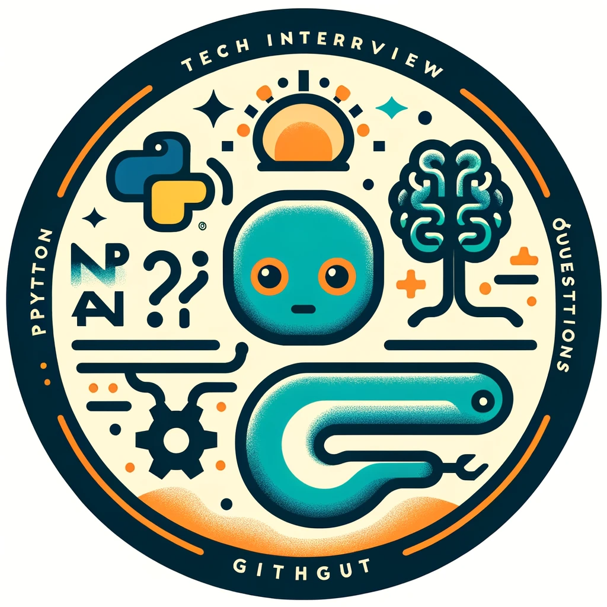

# tech-interview-hub
*Makine öğrenmesi*, *doğal dil işleme*, *veri bilimi* gibi alanlarda veya *python* ilintili pozisyonlarda daha önce sorulmuş mülakat sorularını içermektedir.

---
#### Sorular

1. Tf-Idf nedir?

2. BERT ve GPT modelleri arasında ne gibi farklılıklar var?

3. Dialogflow veya RASA kullandınız mı, kullandıysanız arasındaki farklar nelerdir?

4. Token nedir?

5. LLM kullanımında system prompt uzamaması için ilk aklınıza gelen çözüm ne olur?

6. List ve set arasındaki fark nedir? 

7. Retrieval Augmented Generation nedir?

8. LLM validasyonu nasıl yapılır?

9. Cosine similarity nedir ve bir LLM ile nasıl kullanırsınız?